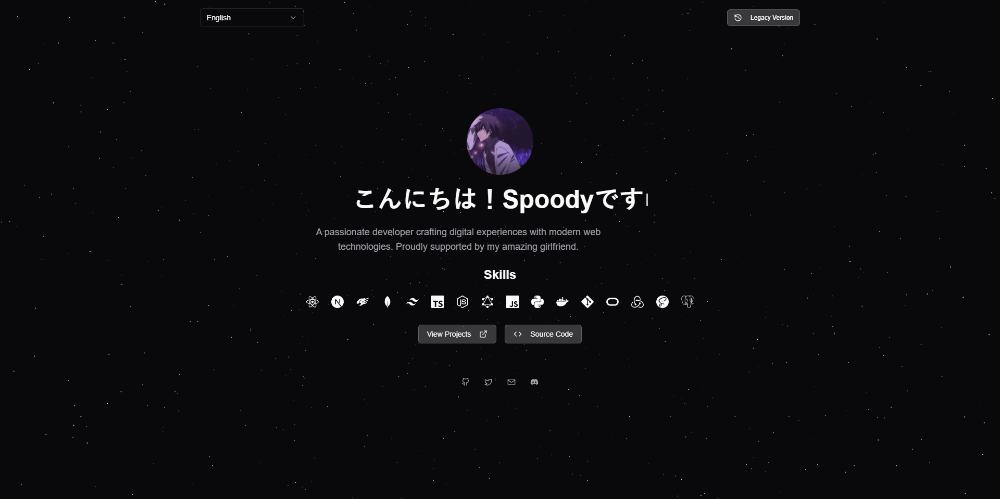
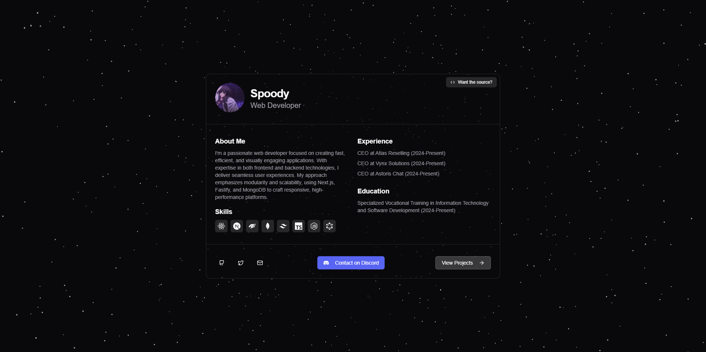

# ✨ Starfield Portfolio

A modern, animated portfolio template featuring a stunning 3D starfield background, smooth animations, and a clean, professional design. Built with Next.js, Three.js, and Tailwind CSS.

## 📸 Screenshots

### New Preview



### Legacy Preview



## 🚀 Features

- 3D animated starfield background
- Smooth animations and transitions
- Responsive design
- Dark mode optimized
- Type writer effect
- Skills showcase with icons
- Social media integration
- Easy to customize
- SEO friendly

## 📦 Installation

1. Clone the repository:

```shell
git clone https://github.com/spooderman11/crispy-happiness.git
```

2. Install dependencies:

### Using PNPM (default):

This project uses "PNPM" as the default package manager. If you don't have it installed, you can install it by running the following command:

```shell
npm install -g pnpm
```

Then, install the dependencies:

```shell
cd crispy-happiness
pnpm install
```

### Using npm:

If you prefer to use npm, delete the `pnpm-lock.yaml` file and run:

```shell
cd crispy-happiness
npm install
```

### Using yarn:

If you prefer to use yarn, delete the `pnpm-lock.yaml` file and run:

```shell
cd crispy-happiness
yarn install
```

3. Run the development server:

### Using PNPM:

```shell
pnpm dev
```

### Using npm:

```shell
npm run dev
```

### Using yarn:

```shell
yarn dev
```

## 🎨 Customization

### Personal Information

Edit the following in `src/app/page.tsx`:

- Update the profile picture URL
- Modify personal details (name, title, about me)
- Update experience and education sections
- Customize skills icons
- Change social media links

### Styling

The project uses Tailwind CSS and shadcn/ui for styling:

- Modify the theme in `tailwind.config.ts`
- Customize component styles in the respective component files
- Adjust animations by modifying the motion variants

### Starfield

Customize the starfield background in the `AnimatedStars` component:

- Adjust star count, depth, and radius
- Modify rotation speed and animation parameters
- Change colors and saturation

## 🤝 Contributing

Contributions are welcome! Feel free to:

1. Fork the repository
2. Create a new branch (`git checkout -b feature/amazing-feature`)
3. Make your changes
4. Commit your changes (`git commit -m 'Add some amazing feature'`)
5. Push to the branch (`git push origin feature/amazing-feature`)
6. Open a Pull Request

## 📄 License

This project is licensed under the Apache License 2.0 - see the [LICENSE](LICENSE) file for details.

Copyright 2024 Spoody

Licensed under the Apache License, Version 2.0 (the "License");
you may not use this file except in compliance with the License.
You may obtain a copy of the License at

[http://www.apache.org/licenses/LICENSE-2.0](http://www.apache.org/licenses/LICENSE-2.0)

Unless required by applicable law or agreed to in writing, software
distributed under the License is distributed on an "AS IS" BASIS,
WITHOUT WARRANTIES OR CONDITIONS OF ANY KIND, either express or implied.
See the License for the specific language governing permissions and
limitations under the License.

## 🙏 Acknowledgments

- Built with [Next.js](https://nextjs.org/)
- UI components from [shadcn/ui](https://ui.shadcn.com/)
- 3D graphics with [Three.js](https://threejs.org/)
- Icons from [React Icons](https://react-icons.github.io/react-icons/)

## 💖 Support

If you find this project helpful, please consider giving it a ⭐️!

## 🔗 Links

- [GitHub Repository](https://github.com/spooderman11/crispy-happiness)
- [Report Issues](https://github.com/spooderman11/crispy-happiness/issues)
- [Request Features](https://github.com/spooderman11/crispy-happiness/issues)
